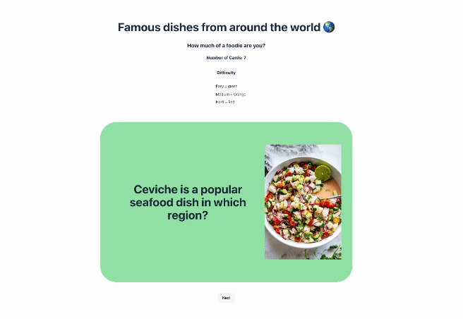

# Flashcards
Flashcards is a flashcard-like format that users can then use to study, learn something new, or play a guessing game. Users will be able to study cards in a randomized order.

**The following **required** functionality is completed:**

[x] The app displays the title of the card set, a short description, and the total number of cards

[x] A single card at a time is displayed

[x] Clicking on the card shows the corresponding component of the information pair

[x] Clicking the next button displays a random new card

**The following **optional** functionality are implemented:**

[x] Cards contain images in addition to or in place of text

[x] Cards have different visual styles based on their category

# Here's how Community Board looks:



# Getting started
**Install dependencies**
```
npm install
```

**Run the application in developer mode**

```
npm run dev
```

**Open project in the browser**

In the command line Vite will display a link, such as http://127.0.0.1:5173 to click on or copy/paste that will take you to the localhost port where the project is running.

**Tip:** If you'd like to stop the server, you can use ctrl + c or cmd + c within the Terminal, or use the trash can icon in the top right of the Terminal within VS Code. To run the server again, simply use npm run dev again.